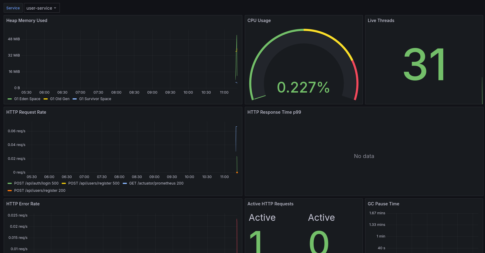

# Library System — Mikroservisni Sistem

Distribuirani sistem za upravljanje bibliotekom razvijen korišćenjem Spring Cloud mikroservisne arhitekture. Sistem omogućava upravljanje knjigama, korisnicima, pozajmicama i kaznama kroz skup nezavisnih mikroservisa koji komuniciraju sinhronim i asinhronim putem.

---

## Sadržaj

- [Opis poslovne logike](#opis-poslovne-logike)
- [Arhitektura sistema](#arhitektura-sistema)
- [Mikroservisi](#mikroservisi)
- [Komunikacija između servisa](#komunikacija-između-servisa)
- [Tehnički stack](#tehnički-stack)
- [Pokretanje sistema](#pokretanje-sistema)
- [CI/CD Pipeline](#cicd-pipeline)
- [Monitoring](#monitoring)
- [API dokumentacija](#api-dokumentacija)

---

## Opis poslovne logike

Library System je platforma za upravljanje bibliotekom koja podržava tri vrste korisnika:

- **USER** — registrovani član biblioteke koji može pregledati katalog knjiga, pozajmljivati i vraćati knjige, te pregledati sopstvene pozajmice i kazne
- **LIBRARIAN** — bibliotekar koji može dodavati i ažurirati knjige u katalogu
- **ADMIN** — administrator koji može suspendovati korisnike, brisati knjige, te pregledati sve pozajmice i kazne u sistemu

### Poslovni procesi

**Registracija i autentifikacija**
Korisnik se registruje putem sistema, čime automatski dobija jednogodišnje članstvo sa statusom `ACTIVE`. Autentifikacija se vrši putem JWT tokena koji nosi informaciju o korisniku i njegovoj ulozi. Svaki zahtev prema sistemu (osim registracije i prijave) mora sadržati validan JWT token.

**Pozajmljivanje knjiga**
Kada korisnik želi da pozajmi knjigu, sistem prvo proverava da li korisnikovo članstvo ima status `ACTIVE` i da li korisnik nije suspendovan. Zatim proverava dostupnost knjige. Ako su oba uslova ispunjena, kreira se pozajmica sa rokom vraćanja od 14 dana, a broj dostupnih primeraka knjige se smanjuje za jedan. Nakon kreiranja pozajmice, sistem asinhrono obaveštava korisnika putem email-a.

**Vraćanje knjiga**
Kada korisnik vrati knjigu, status pozajmice se menja u `RETURNED`, postavlja se datum vraćanja, i broj dostupnih primeraka se povećava. Korisnik dobija email potvrdu o vraćanju.

**Upravljanje kasnjenjem**
Svaki sat, `loan-service` proverava da li postoje aktivne pozajmice čiji je rok vraćanja istekao. Takve pozajmice dobijaju status `OVERDUE`, i sistem asinhrono objavljuje događaj koji:
- `fine-service` konzumira i kreira kaznu (0.50 po danu kašnjenja)
- `notification-service` konzumira i šalje upozorenje korisniku

**Kazne**
Kazne se kreiraju automatski kada pozajmica postane prekoračena. Admin može pregledati sve kazne u sistemu. Kazna se može platiti promenom statusa iz `PENDING` u `PAID`.

---

## Arhitektura sistema

```
                          ┌─────────────────┐
                          │   API Gateway   │
                          │   (port 8080)   │
                          │  JWT validation │
                          │  Role-based     │
                          │  access control │
                          └────────┬────────┘
                                   │
              ┌────────────────────┼────────────────────┐
              │                    │                    │
    ┌─────────▼──────┐   ┌────────▼───────┐   ┌───────▼────────┐
    │  user-service  │   │  book-service  │   │  loan-service  │
    │  (port 8081)   │   │  (port 8084)   │   │  (port 8082)   │
    │  PostgreSQL    │   │  MongoDB       │   │  PostgreSQL    │
    └────────────────┘   └────────────────┘   └───────┬────────┘
                                                       │
                                              Kafka events
                                                       │
                              ┌────────────────────────┼──────────────────────┐
                              │                                               │
                   ┌──────────▼──────────┐                        ┌──────────▼──────────┐
                   │ notification-service│                        │    fine-service     │
                   │    (port 8083)      │                        │    (port 8085)      │
                   │  Kafka consumer     │                        │  PostgreSQL         │
                   │  Email via SMTP     │                        │  Kafka consumer     │
                   └─────────────────────┘                        └─────────────────────┘

┌─────────────────────┐    ┌─────────────────────┐
│   config-server     │    │  discovery-server   │
│   (port 8888)       │    │  Eureka             │
│   Centralized       │    │  (port 8761)        │
│   configuration     │    │  Service registry   │
└─────────────────────┘    └─────────────────────┘

┌─────────────────────┐    ┌─────────────────────┐
│     Prometheus      │    │      Grafana        │
│   (port 9090)       │    │   (port 3000)       │
│   Metrics scraping  │    │   Dashboards        │
└─────────────────────┘    └─────────────────────┘
```

### Komunikacija između servisa

**Sinhrona komunikacija (REST via OpenFeign)**

| Izvor | Odredište | Endpoint | Svrha |
|---|---|---|---|
| loan-service | user-service | `GET /api/users/{id}/membership` | Provjera statusa članstva pre pozajmice |
| loan-service | book-service | `GET /api/books/{id}/availability` | Provjera dostupnosti knjige |
| loan-service | book-service | `PATCH /api/books/{id}/decrease` | Smanjivanje broja primeraka |
| loan-service | book-service | `PATCH /api/books/{id}/increase` | Povećavanje broja primeraka pri vraćanju |
| notification-service | user-service | `GET /api/users/{id}` | Dohvatanje email adrese korisnika |

**Asinhrona komunikacija (Apache Kafka)**

| Topic | Producent | Konzumenti | Okidač |
|---|---|---|---|
| `loan-created` | loan-service | notification-service | Kreiranje pozajmice |
| `loan-returned` | loan-service | notification-service | Vraćanje knjige |
| `loan-overdue` | loan-service | notification-service, fine-service | Scheduler — svaki sat |

---

## Mikroservisi

### 1. config-server (port 8888)
Centralizovani server za konfiguraciju svih mikroservisa. Koristi `native` profil za čitanje konfiguracionih fajlova iz lokalnog `config-repo` foldera. Svi ostali servisi pri startu dohvataju konfiguraciju odavde, uključujući `jwt.secret`, Eureka URL i Kafka adresu.

### 2. discovery-server (port 8761)
Eureka server za registraciju i otkrivanje servisa. Svaki mikroservis se registruje ovde pri startu. API Gateway i Feign klijenti koriste Eureka za dinamičko otkrivanje adresa servisa umesto hardkodovanih URL-ova.

### 3. api-gateway (port 8080)
Jedina ulazna tačka u sistem. Odgovoran za:
- Validaciju JWT tokena na svakom zahtevu
- Primenu role-based access control (USER / LIBRARIAN / ADMIN)
- Rutiranje zahteva ka odgovarajućim servisima putem Eureka load balancera
- Javne endpointe: `POST /api/auth/login` i `POST /api/auth/register`

### 4. user-service (port 8081)
Upravljanje korisnicima i autentifikacijom. Baza podataka: PostgreSQL (`user_db`).
- Registracija, prijava, generisanje JWT tokena
- Upravljanje statusom članstva (ACTIVE, EXPIRED, SUSPENDED)
- Suspenzija korisnika (ADMIN only)

### 5. book-service (port 8084)
Katalog knjiga. Baza podataka: MongoDB (`book_db`) — demonstracija polyglot persistence.
- CRUD operacije nad knjigama
- Pretraga po naslovu, autoru i žanru
- Upravljanje dostupnim primercima

### 6. loan-service (port 8082)
Srce sistema — upravljanje pozajmicama. Baza podataka: PostgreSQL (`loan_db`).
- Kreiranje i vraćanje pozajmica uz validaciju poslovnih pravila
- Sinhrona komunikacija sa user-service i book-service via Feign
- Objavljivanje Kafka događaja
- Scheduled job za detekciju prekoračenih pozajmica

### 7. notification-service (port 8083)
Asinhroni konzument Kafka događaja. Nema sopstvenu bazu podataka.
- Konzumira `loan-created`, `loan-returned`, `loan-overdue` događaje
- Dohvata email korisnika via Feign poziv ka user-service
- Šalje email notifikacije putem JavaMailSender (Gmail SMTP)

### 8. fine-service (port 8085)
Upravljanje kaznama. Baza podataka: PostgreSQL (`fine_db`).
- Konzumira `loan-overdue` Kafka događaje
- Kreira kazne (0.50 po danu kašnjenja)
- Idempotentno kreiranje — ne kreira duplikat kazne za istu pozajmicu
- REST API za pregled i plaćanje kazni

---

## Tehnički stack

| Kategorija | Tehnologija |
|---|---|
| Backend framework | Spring Boot 3.4.1 |
| Mikroservisna infrastruktura | Spring Cloud 2024.0.0 |
| Service discovery | Netflix Eureka |
| API Gateway | Spring Cloud Gateway |
| Konfiguracija | Spring Cloud Config Server |
| Sinhrona komunikacija | Spring Cloud OpenFeign |
| Asinhrona komunikacija | Apache Kafka 3.8 |
| Relacione baze | PostgreSQL 16 |
| Dokumentna baza | MongoDB 7 |
| Sigurnost | Spring Security, JWT (jjwt 0.12.6) |
| Monitoring | Prometheus, Grafana 10.4.3 |
| Kontejnerizacija | Docker, Docker Compose |
| CI/CD | GitHub Actions |
| Java verzija | Java 21 |

---

## Pokretanje sistema

### Preduslovi

- Docker i Docker Compose
- Java 21 (samo za lokalni razvoj)
- Maven 3.8+ (samo za lokalni razvoj)
- Git

### Kloniranje repozitorijuma

```bash
git clone https://github.com/FilipJosifljevic/library-system.git
cd library-system
```

### Produkcijsko okruženje (Docker Compose)

Pokretanje kompletnog sistema jednom komandom:

```bash
docker compose up --build
```

Ovo pokreće sve servise u ispravnom redosledu:
1. Infrastruktura (PostgreSQL x3, MongoDB, Kafka)
2. config-server, discovery-server
3. Svi biznis mikroservisi
4. api-gateway
5. Prometheus, Grafana

Nakon pokretanja, servisi su dostupni na:

| Servis | URL |
|---|---|
| API Gateway (ulazna tačka) | http://localhost:8080 |
| Eureka Dashboard | http://localhost:8761 |
| Config Server | http://localhost:8888 |
| Grafana | http://localhost:3000 |
| Prometheus | http://localhost:9090 |

Zaustaviti sistem:
```bash
docker compose down
```

Zaustaviti sistem i obrisati sve podatke (volumes):
```bash
docker compose down -v
```

### Razvojno okruženje (lokalno)

Za lokalni razvoj, servisi se mogu pokretati direktno iz STS (Spring Tool Suite) ili Maven-om.

**Preduslovi za lokalni razvoj:**
```bash
# Pokrenuti infrastrukturu
docker run -d --name mongo-books -p 27017:27017 \
  -e MONGO_INITDB_ROOT_USERNAME=library \
  -e MONGO_INITDB_ROOT_PASSWORD=library123 mongo:7

docker run -d --name kafka -p 9092:9092 \
  -e KAFKA_NODE_ID=1 \
  -e KAFKA_PROCESS_ROLES=broker,controller \
  -e KAFKA_LISTENERS=PLAINTEXT://:9092,CONTROLLER://:9093 \
  -e KAFKA_ADVERTISED_LISTENERS=PLAINTEXT://localhost:9092 \
  -e KAFKA_CONTROLLER_QUORUM_VOTERS=1@localhost:9093 \
  -e KAFKA_CONTROLLER_LISTENER_NAMES=CONTROLLER \
  -e KAFKA_LISTENER_SECURITY_PROTOCOL_MAP=CONTROLLER:PLAINTEXT,PLAINTEXT:PLAINTEXT \
  -e KAFKA_OFFSETS_TOPIC_REPLICATION_FACTOR=1 \
  -e CLUSTER_ID=MkU3OEVBNTcwNTJENDM2Qk \
  apache/kafka:3.8.0

# PostgreSQL mora biti instaliran lokalno
sudo -u postgres psql -c "CREATE DATABASE user_db;"
sudo -u postgres psql -c "CREATE DATABASE loan_db;"
sudo -u postgres psql -c "CREATE DATABASE fine_db;"
sudo -u postgres psql -c "CREATE USER library WITH PASSWORD 'library123';"
sudo -u postgres psql -c "GRANT ALL PRIVILEGES ON DATABASE user_db TO library;"
sudo -u postgres psql -c "GRANT ALL PRIVILEGES ON DATABASE loan_db TO library;"
sudo -u postgres psql -c "GRANT ALL PRIVILEGES ON DATABASE fine_db TO library;"
sudo -u postgres psql -d user_db -c "GRANT ALL ON SCHEMA public TO library;"
sudo -u postgres psql -d loan_db -c "GRANT ALL ON SCHEMA public TO library;"
sudo -u postgres psql -d fine_db -c "GRANT ALL ON SCHEMA public TO library;"
```

**Redosled pokretanja servisa:**
1. `config-server` — port 8888
2. `discovery-server` — port 8761
3. `user-service`, `book-service` — port 8081, 8084
4. `loan-service` — port 8082
5. `notification-service`, `fine-service` — port 8083, 8085
6. `api-gateway` — port 8080

**Build svih modula:**
```bash
mvn clean install -DskipTests
```

**Pokretanje pojedinog servisa:**
```bash
cd user-service
mvn spring-boot:run
```

---

## CI/CD Pipeline

Pipeline je definisan u `.github/workflows/ci-cd.yml` i automatski se pokreće pri svakom push-u na `main` ili `develop` granu, kao i pri otvaranju Pull Request-a prema `main`.

### Faze pipeline-a

```
push to main/develop/PR
         │
         ▼
┌─────────────────┐
│ build-and-test  │  ← Uvek se izvršava
│                 │
│ • Checkout      │
│ • Setup Java 21 │
│ • mvn install   │
│ • mvn test      │
│ • Upload results│
└────────┬────────┘
         │
    ┌────┴─────┐
    │          │
    ▼          ▼
┌───────────┐  ┌──────────────────┐
│integration│  │docker-build-push │ ← Samo na main branch
│  -tests   │  │                  │
│           │  │ Matrix build:    │
│• Start    │  │ • config-server  │
│  infra    │  │ • discovery-server│
│• Run tests│  │ • api-gateway    │
│• Teardown │  │ • user-service   │
└───────────┘  │ • book-service   │
               │ • loan-service   │
               │ • notification   │
               │ • fine-service   │
               │                  │
               │ Push to DockerHub│
               └────────┬─────────┘
                        │
                        ▼
               ┌─────────────────┐
               │     notify      │
               │                 │
               │ ✅ Success or   │
               │ ❌ Failure      │
               └─────────────────┘
```

### Pokretanje pipeline-a

**Automatsko pokretanje:**
```bash
# Svaki push na main pokreće kompletan pipeline
git add .
git commit -m "feat: opis izmene"
git push origin main
```

**Praćenje pipeline-a:**
1. Otvoriti GitHub repozitorijum
2. Kliknuti na **Actions** tab
3. Videti listu pokrenutih workflow-ova sa statusom

**Docker slike na Docker Hub:**

Nakon uspešnog pipeline-a na `main` grani, slike su dostupne na Docker Hub-u:
```
filipjosifljevic/library-config-server:latest
filipjosifljevic/library-discovery-server:latest
filipjosifljevic/library-api-gateway:latest
filipjosifljevic/library-user-service:latest
filipjosifljevic/library-book-service:latest
filipjosifljevic/library-loan-service:latest
filipjosifljevic/library-notification-service:latest
filipjosifljevic/library-fine-service:latest
```

**Tagovi slika:**
- `latest` — poslednja verzija sa main grane
- `main` — oznaka grane
- `sha-<commit>` — specifičan commit SHA za rollback

### GitHub Secrets

Za ispravno funkcionisanje pipeline-a, potrebno je podesiti sledeće tajne u GitHub repozitorijumu (**Settings → Secrets and variables → Actions**):

| Secret | Opis |
|---|---|
| `DOCKERHUB_USERNAME` | Docker Hub korisničko ime |
| `DOCKERHUB_TOKEN` | Docker Hub access token |

### Razvojni vs produkcijski deploy

| Faza | Grana | Akcije |
|---|---|---|
| Razvoj | `develop` | Build + unit testovi |
| Pull Request | `feature/*` → `main` | Build + unit testovi + code review |
| Produkcija | `main` | Build + testovi + Docker build + push na Docker Hub |

---

## Monitoring

### Prometheus

Prometheus automatski scrape-uje `/actuator/prometheus` endpoint svakog mikroservisa svakih 15 sekundi.

Dostupno na: **http://localhost:9090**

Primeri upita:
```promql
# JVM heap memorija po servisu
jvm_memory_used_bytes{application="user-service", area="heap"}

# HTTP request rate
rate(http_server_requests_seconds_count{application="loan-service"}[1m])

# p99 response time
histogram_quantile(0.99, rate(http_server_requests_seconds_bucket[1m]))

# Aktivne DB konekcije
hikaricp_connections_active{application="user-service"}
```

### Grafana

Dostupno na: **http://localhost:3000**

Dashboard **Library System Monitoring** je automatski provizioniran i sadrži:
- JVM Heap i Non-Heap memorija po servisu
- CPU usage
- HTTP request rate i response time (p50, p95, p99)
- HTTP greške (4xx, 5xx)
- Aktivni HTTP zahtevi
- JVM niti (threads)
- GC pauze
- HikariCP connection pool metrike


---

## API dokumentacija

Svi zahtevi idu kroz API Gateway na **http://localhost:8080**.

### Autentifikacija

```bash
# Registracija
POST /api/auth/register
{
  "firstName": "Marko",
  "lastName": "Markovic",
  "email": "marko@example.com",
  "password": "password123"
}

# Prijava — vraća JWT token
POST /api/auth/login
{
  "email": "marko@example.com",
  "password": "password123"
}
```

Sve ostale rute zahtevaju `Authorization: Bearer <token>` header.

### Knjige

```bash
GET    /api/books                    # Pregled svih knjiga (USER+)
GET    /api/books?title=Java         # Pretraga po naslovu
GET    /api/books?author=Bloch       # Pretraga po autoru
GET    /api/books?genre=Programming  # Pretraga po žanru
GET    /api/books/{id}               # Detalji knjige
GET    /api/books/{id}/availability  # Dostupnost knjige
POST   /api/books                    # Dodavanje knjige (LIBRARIAN, ADMIN)
PUT    /api/books/{id}               # Izmena knjige (LIBRARIAN, ADMIN)
DELETE /api/books/{id}               # Brisanje knjige (ADMIN)
```

### Korisnici

```bash
POST   /api/users/register           # Registracija
GET    /api/users/{id}               # Profil korisnika (USER+)
PUT    /api/users/{id}               # Izmena profila (USER+)
GET    /api/users/{id}/membership    # Status članstva
PUT    /api/users/{id}/suspend       # Suspenzija korisnika (ADMIN)
```

### Pozajmice

```bash
POST   /api/loans                    # Kreiranje pozajmice (USER+)
GET    /api/loans/{id}               # Detalji pozajmice (USER+)
GET    /api/loans/user/{userId}      # Pozajmice korisnika (USER+)
GET    /api/loans                    # Sve pozajmice (ADMIN, LIBRARIAN)
PATCH  /api/loans/{id}/return        # Vraćanje knjige (USER+)
```

### Kazne

```bash
GET    /api/fines                    # Sve kazne (ADMIN)
GET    /api/fines/{id}               # Detalji kazne (ADMIN)
GET    /api/fines/user/{userId}      # Kazne korisnika (USER+)
PATCH  /api/fines/{id}/pay           # Plaćanje kazne (ADMIN)
```

### Role i dozvole

| Endpoint | USER | LIBRARIAN | ADMIN |
|---|:---:|:---:|:---:|
| Registracija / Prijava | ✅ | ✅ | ✅ |
| Pregled knjiga | ✅ | ✅ | ✅ |
| Dodavanje / izmena knjiga | ❌ | ✅ | ✅ |
| Brisanje knjiga | ❌ | ❌ | ✅ |
| Kreiranje / vraćanje pozajmice | ✅ | ✅ | ✅ |
| Pregled sopstvenih pozajmica | ✅ | ✅ | ✅ |
| Pregled svih pozajmica | ❌ | ✅ | ✅ |
| Pregled sopstvenih kazni | ✅ | ✅ | ✅ |
| Pregled svih kazni | ❌ | ❌ | ✅ |
| Plaćanje kazne | ❌ | ❌ | ✅ |
| Suspenzija korisnika | ❌ | ❌ | ✅ |

---

## Struktura repozitorijuma

```
library-system/
├── .github/
│   └── workflows/
│       └── ci-cd.yml              ← GitHub Actions pipeline
├── config-repo/                   ← Centralizovana konfiguracija
│   ├── application.properties     ← Deljene postavke (jwt.secret, eureka, kafka)
│   ├── application-docker.properties ← Docker-specifične postavke
│   └── prometheus.yml             ← Prometheus scrape konfiguracija
├── grafana/
│   └── provisioning/              ← Auto-provizionisani dashboardi i datasources
├── config-server/
├── discovery-server/
├── api-gateway/
├── user-service/
├── book-service/
├── loan-service/
├── notification-service/
├── fine-service/
├── docker-compose.yml             ← Kompletna kontejnerizacija
└── pom.xml                        ← Parent Maven POM
```
